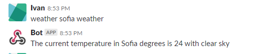
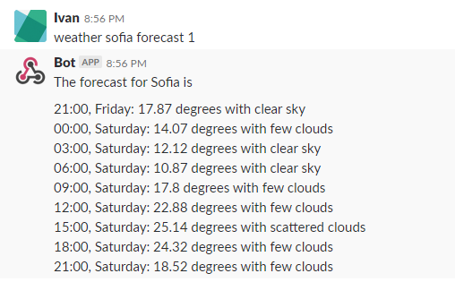
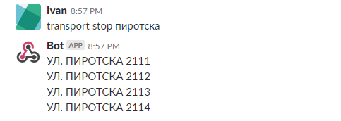
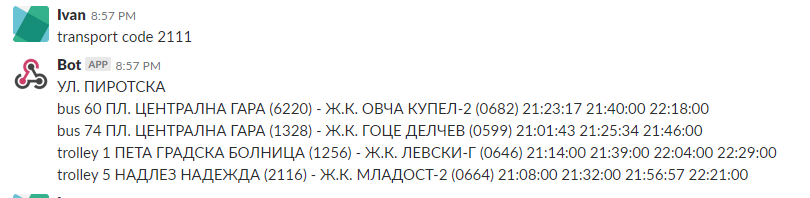
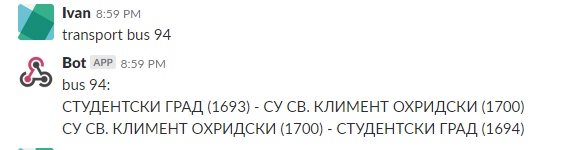
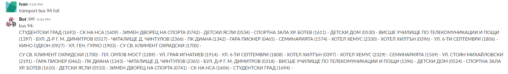
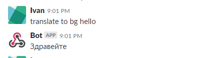
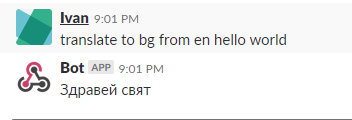

# home-bot

## Help

1. Weather module
 - Current weather (returns what is the weather currently in the given city)
    > weather ${city} weather
    
    
    
 - Forecast (returns the forecast for given city for the next 0-3 days)
    > weather ${city} forecast ${days?}
    
    

2. Public transport module
  - Stop search (returns list of stops, matching given keyword)
    > transport stop ${stopName}
    
    

  - Stop table line times (returns list of lines and their arrival times for given stop)
    > transport code ${code}
    
    
    
  - Line info (returns the line routes, optionally if parameter 'full' is given, displays full route for given line)
    > transport ${bus|trolley|tram} ${lineName} ${full?}
    
    
    
    
    
3. Translation module
  - Translate given sentence, from parameter is required. If to parameter not given, auto detects the destination language
    > translate from ${fromLanguage} to? ${toLanguage?} ${text}
    
    
    
    
